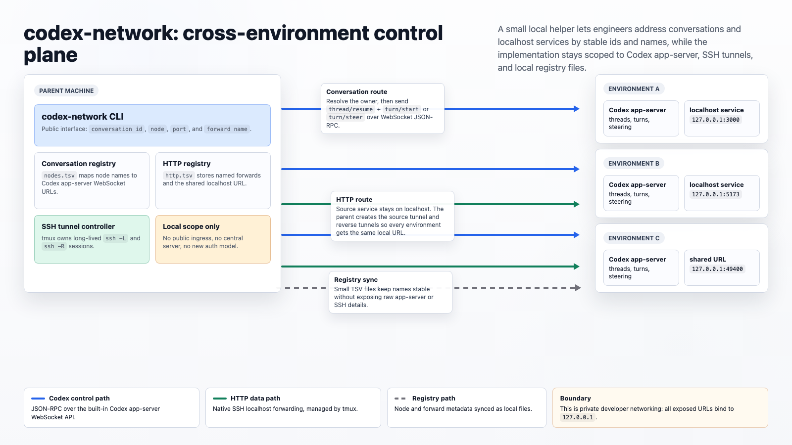

# codex-network

`codex-network` is a local/remote networking helper for Codex desktop sessions.

It needs Codex CLI/app-server, SSH access to remote developer environments,
`tmux`, `curl`, and Node.js 24 or newer for the native WebSocket runtime. The Codex app-server
methods used here are experimental, so pinning or checking against your Codex CLI version is
sensible before depending on this in automation.

It does two things:

1. Lists and sends messages to Codex conversations across the local machine and subscribed remote
   environments by conversation id.
2. Exposes named HTTP forwards so the same `http://127.0.0.1:<port>` URL works from the parent
   machine and every subscribed remote environment.

The helper intentionally hides low-level SSH tunnel and app-server endpoint details from the normal
CLI. In day-to-day use, pass conversation ids, node names, ports, and forward names.

## Under The Hood

Conversation networking uses Codex app-server v2 JSON-RPC over the built-in WebSocket transport.

HTTP forwarding uses native SSH tunnels:

- `ssh -L` from the parent to the source environment.
- `ssh -R` from the parent into each subscribed remote host, so every node gets the same localhost
  URL.
- A tiny Node TCP proxy is used only when remapping a parent-local service from one localhost port
  to another.
- A parent-local control server, also exposed over SSH `-R`, lets a remote host request forward
  creation or teardown without owning the parent machine's SSH configuration.

## Architecture



The diagram source is editable HTML at [`docs/architecture.html`](docs/architecture.html).

## Install

```bash
./install.sh
```

This installs:

- `bin/codex-network` to `~/.local/bin/codex-network`
- `lib/codex-network` to `~/.local/lib/codex-network`
- the Codex skill to `~/.agents/skills/codex-network`

To also copy the skill into another local skill directory, set:

```bash
CODEX_NETWORK_EXTRA_SKILLS_DIR=/path/to/skills ./install.sh
```

To copy the helper and skill to all managed remote hosts:

```bash
scripts/sync-remotes.sh
codex-network expose-parent --all-hosts
```

`expose-parent` makes the parent Codex app-server and the parent forwarding control endpoint
reachable from each remote host on `127.0.0.1`. After that, a remote host can run
`codex-network http expose ...` or `codex-network http stop ...`; those commands delegate the
requested mesh change back to the parent automatically.

Remote host discovery uses the first available source:

1. `CODEX_NETWORK_SSH_HOSTS`, as a space- or comma-separated list.
2. `~/.codex-network/hosts`, one SSH host alias per line.
3. A `# BEGIN codex-network hosts` block in `~/.ssh/config`.

Example SSH config block:

```sshconfig
# BEGIN codex-network hosts
Host codex-remote-a
  HostName remote-a.example.com
  User alice

Host codex-remote-b
  HostName remote-b.example.com
  User alice
# END codex-network hosts
```

The older `# BEGIN Codex RDE aliases` block is still supported for existing setups. The
`scripts/sync-rdes.sh` script remains as a compatibility wrapper.

`codex-network` loads helper code from `../lib/codex-network` relative to the binary. Override that
with `CODEX_NETWORK_LIB_DIR` if you use a custom install layout.

## Conversation Commands

List conversations across subscribed nodes:

```bash
codex-network list --limit 100
```

Send a message to any conversation by id:

```bash
codex-network send <conversation-id> --message "continue from here"
```

The helper resolves the conversation owner before sending.

## HTTP Forward Commands

Expose a service running on an explicit node:

```bash
codex-network http expose <remote-node>:38080 --name remote-app
```

Expose a service by the conversation that owns the environment:

```bash
codex-network http expose --conversation-id <conversation-id> --port 38080 --name review-app
```

List active forwards:

```bash
codex-network http list
```

Resolve a forward URL from any subscribed environment:

```bash
codex-network http url review-app
```

Stop a forward:

```bash
codex-network http stop review-app
```

Create and stop commands can be run from the parent or from a subscribed remote host. When a remote
host has no local SSH host registry, it sends the request to the parent control endpoint exposed by
`codex-network expose-parent --all-hosts`.

Check the parent control endpoint:

```bash
codex-network control status
```

Validate conversation-id routing across nodes and workspaces:

```bash
codex-network doctor conversations --limit 100
codex-network doctor conversations --workspace /path/to/workspace
```

The doctor lists recent conversations, grouped by their workspace path, and verifies that each
conversation id resolves back to the same node and thread that listed it.

## Required Local State

`~/.codex-network/nodes.tsv` maps node names to Codex app-server WebSocket URLs:

```text
local	ws://127.0.0.1:49321
codex-remote-a	ws://127.0.0.1:49334
```

`~/.codex-network/hosts` is an optional host registry used by sync and forwarding:

```text
codex-remote-a
codex-remote-b
```

`~/.codex-network/http.tsv` is managed by `codex-network http expose` and synced to remote hosts.

`scripts/sync-remotes.sh` writes a remote-specific `~/.codex-network/nodes.tsv` plus
`~/.codex-network/node` so each RDE can resolve the parent, itself, and other subscribed nodes while
default port exposes still resolve to the current remote node.

## Safety

- URLs are bound to `127.0.0.1`.
- The forwarding control server binds to `127.0.0.1` and only accepts validated `http expose` and
  `http stop` requests.
- Forward names are restricted to safe characters.
- Ports are validated before tunnel creation.
- The helper does not print OAuth tokens or Codex credentials.
- The public workflow avoids raw app-server URLs and raw SSH tunnel arguments.

## Validation

Run the full gate locally with:

```bash
npm ci
npm run check
```

The gate uses purpose-built validators for each part of the project:

- Bash CLI and install/sync scripts: `bash -n` and ShellCheck.
- Node WebSocket, TCP proxy, and parent control helpers: `node --check` and ESLint.
- Markdown, HTML, YAML, JSON, and ESM formatting: Prettier.
- Markdown documentation: markdownlint.
- GitHub Actions workflow: actionlint.
- Dependency hygiene: `npm audit --audit-level=moderate`.
- Runtime smoke: CLI help, HTTP registry listing, host discovery, parent control, HTTP proxy,
  conversation-id doctor, and install layout.
